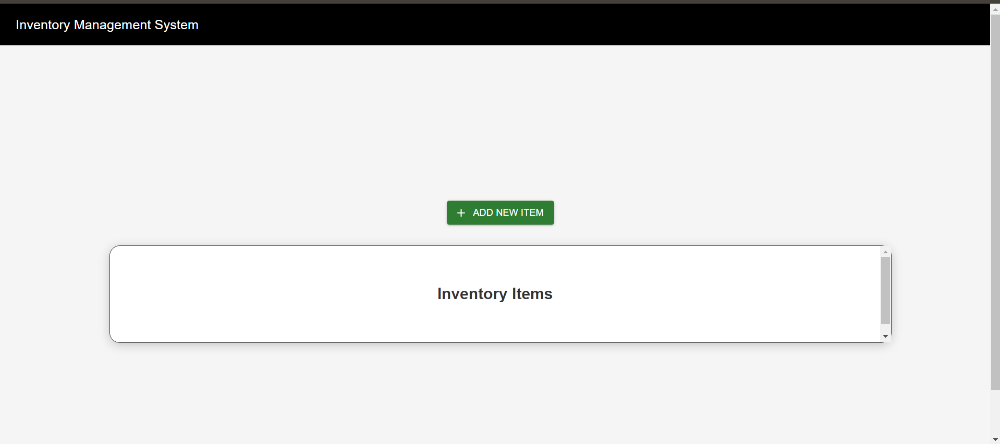
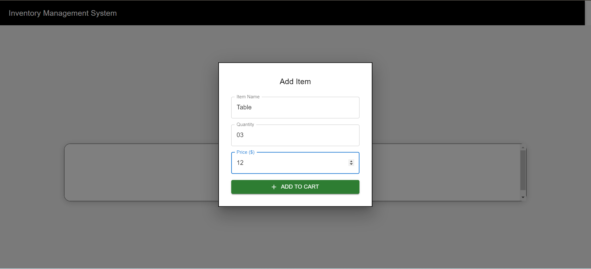
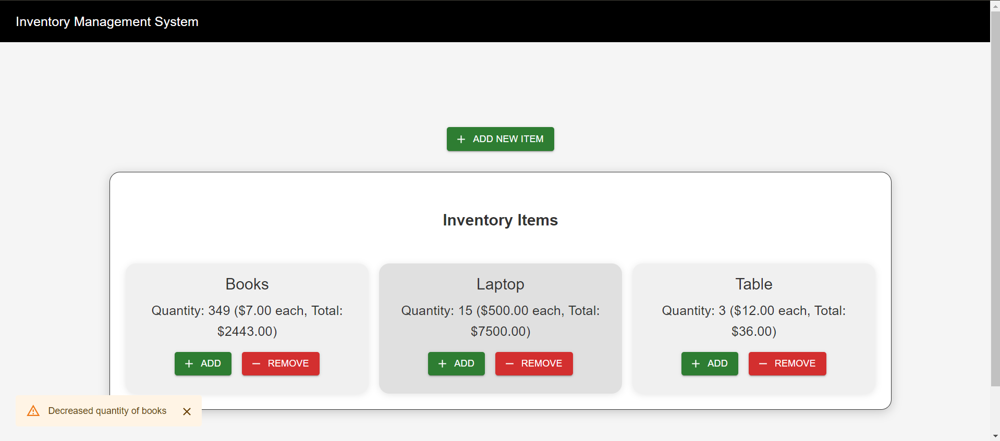

# Inventory Management System

Welcome to the **Inventory Management System**! This project is a modern, user-friendly web application designed to help you manage your inventory with ease. Built using the latest technologies, it offers a clean interface and efficient management of items, allowing you to add, update, and remove inventory items seamlessly. Whether you’re managing a small business or simply keeping track of personal items, this tool provides a comprehensive solution with a sleek, intuitive design.

## 🚀 Features

- **Add New Items**: Quickly add new items to your inventory, specifying both quantity and price.
- **Update Item Quantities**: Increase or decrease the quantity of existing items.
- **Remove Items**: Effortlessly remove items from your inventory when they are no longer needed.
- **Real-Time Updates**: Instant feedback with real-time updates on item quantities and prices.
- **Responsive Design**: Works seamlessly on both desktop and mobile devices.
- **Snackbar Notifications**: Informative snackbars to notify users of successful actions or errors.

## 🔧 Technologies Used

## 📸 Screenshots

  
  
  
